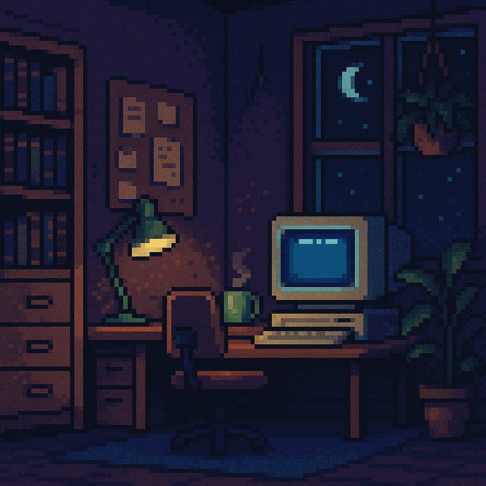

<h1 align="center"><samp>Olá 👋, eu sou o João Evangelista!</samp></h1>

<h3 align="center"><samp>Desenvolvedor Full Stack</samp></h3>

## <samp>🛸  Sobre mim</samp>

<table align="center" style="width: 100%;">
  <tr>
    <td align="left" style="width: 60%;">
      

        <samp>
        Atualmente estou cursando Engenharia de Software na UFC Campus Quixadá e desenvolvendo projetos pessoais para expandir meu portfólio. Sempre busco aprender novas tecnologias e aprimorar minhas habilidades.
      </samp>
      

    </td>
    <td align="center" style="width: 40%;">
      
    </td>
  </tr>
</table>

###

<h2 align="center"><samp>Minhas Skills</samp></h2>

###

🛠 <samp><b>Back-end</b></samp>

###

  
  
  
  
  
  
  
  
  

###

🎨 <samp><b>Front-end</b></samp>

###

  
  
  
  
  
  
  
  
  
  
  

###

💾 <samp><b>Databases</b></samp>

###

  
  
  
  
  
  
  

###

☁️ <samp><b>Infraestrutura</b></samp>

###

  
  
  
  
  
  
  
  
  
  
  

###

## 📊 <samp>Github Stats</samp>
###

  
  

###

## 📫 <samp>Contato</samp>

###

  
  

###
